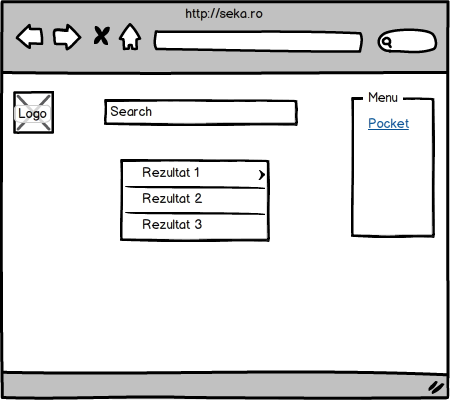

# SEKA
Search Engine Keywords-based Analyzer
=======
##### PLANUL PROIECTULUI TREBUIE PORTAT IN HTML CONFORM CERINTELOR

# SEKA

	

---------------------------------------------------

Strategie

---------------------------------------------------

	Descriere proiect:

Dezvoltaţi o aplicaţie Web responsivă ce permite căutarea de resurse de interes pe baza unui termen ori a unei expresii folosind mai multe motoare de căutare (DuckDuckGo şi altele; eventual, alese de utilizator), plus reţele sociale – Facebook şi Twitter, cel puţin. Pentru fiecare resursă descoperită, instrumentul va prezenta cele mai importante informaţii reunite – preluate, eventual, din mai multe surse. Aceste informaţii vor putea fi salvate local şi partajate – minimal, pe baza serviciului Pocket. Suplimentar, se permite compararea rezultatelor obţinute, cu aplicarea unor posibile filtre şi teme predefinite de vizualizare.

---------------------------------------------------

Specificatii

---------------------------------------------------

###### 1.     Divizare functionalitati
<ol>
	<li> Search
	<ol>
		i. Websites
		<ol>
		<li> Vom folosi api-urile de la</li>
			a. Duck duck go
			 
			b. Twitter
			 
			c. Google
			 
			c. Facebook
             
            c. Instagram
             
		</ol>
	
	</ol>
	<li>Salvare info</li>
	<ol>
		<li>Vom salva</li>
		a.In Contul de Pocket al userului
	</ol>
</ol>

---------------------------------------------------

Structura

---------------------------------------------------

	Design:

1.	Vom structura pagina in trei sectiuni, in stanga va fi o sectiune cu logo-ul, in centru va fi search-ul + rezultate iar in dreapta va fi un meniu pentru partea de salvare
*	Logo – vom folosi un logo icon+text
*	Search rezultate casuta de search va fi sus, iar rezultatele vor aparea in timp real dedesubt cu un layout similar search-urile din sistemele de operare unix.
*	Meniul va fi inchis initial userul avand posibilitatea de a deschide meniul cu un click pe iconita de tip hamburger

---------------------------------------------------

Schelet

---------------------------------------------------

---------------------------------------------------

QOC & Suprafata

---------------------------------------------------
1. Filtrare tip de cautare
 
Question : Cum poate face userul sa filtreze rezultatele, in functie de ce cauta (stiri,imagini,video) ?
 
Options 
a) Putem face pagini separate, pentru fiecare tip de cautare 
b) Putem afisa iconite reprezentative pe care userul sa dea click ca sa selecteze tipul de rezultate.  
 

Criterias 
1. Usor de folosit 
2. Ubicuitate 
3. Usor de implementat 

<table>
<thead>
<tr><td>Criteria</td><td>opt. a</td><td>opt b.</td></tr>
</thead>
<tbody>
<tr><td>1</td><td>1</td><td>2</td></tr>
<tr><td>2</td><td>1</td><td>2</td></tr>
<tr><td>3</td><td>2</td><td>1</td></tr>
</tbody>
</table>
 
Optiunea aleasa este b. Vom afisa iconite sub bara de search si userul va da click pentru a alege tipu de rezultate.
 
	

		Implementare
	

<ol>
	<li> Finalizare design
	<ol>
			a. Adaugare iteme ce apar in urma search-ului
			 
			b. Creare meniu dreapta cu datele de salvare si eventual tur-ul boostrap(macar schita)
	</ol>
	<li>Implementare design css+html</li>
	<ol>
		a.	Implementare structura – stanga dreapta size fix (absolut pe mobil) container size fix, maxim 100% width,  centrat
		 
		b.	Implementare elemente
		<ol>
			i.	Logo
			 
			ii.	Bara search
			 
			iii.	Rezultate aparute in urma search-ului
			 
			iv.	Meniu stanga
			 
		</ol>
		c.	Implementare still css
		 
		d.	Implementare animatii,hovere
	</ol>
	<li>Implementare functionalitate</li>
	a.Implementare api-uri javascript pentru returnare date pe baza unui search
		<ol>
			i.	DuckDuckGo
			 
			ii. Instagram
			 
			iii. Google 
			iv. Facebook 
			vi. Twitter 
		</ol>
		b.Implementare functie de transformare si concatenare a rezultatelor pentru afisare
		<ol>
			i. Posibilitatea de filtrare pe baza de parametrii
		</ol>
		c. Implementare functie de afisare a search+filter pe baza parametriilor get
		 
		d. Implementare functie de stocare a url-urilor in pocket.
		 
</ol>