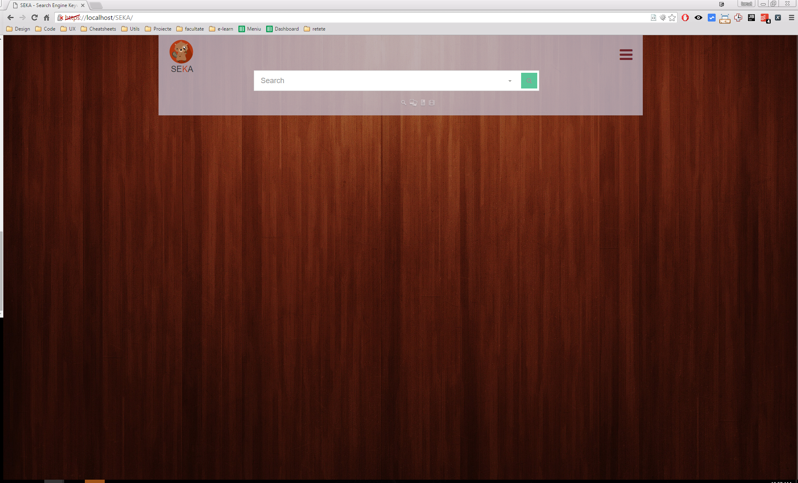
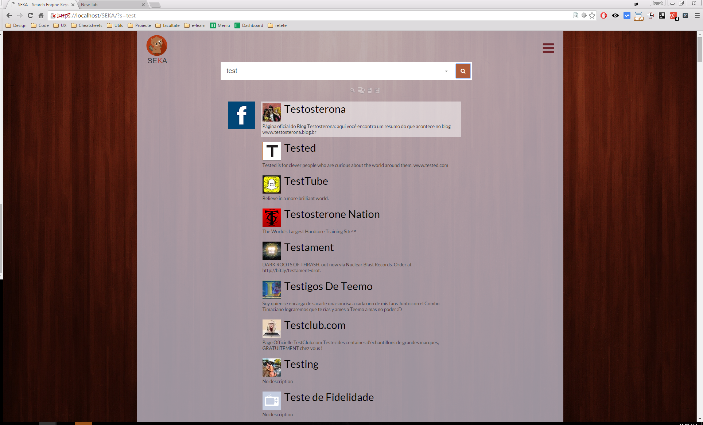
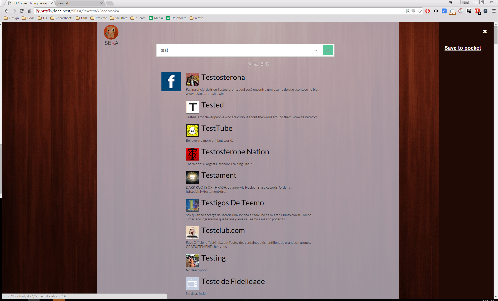

##Prima Pagina
> Pentru a face o cautare trebuie mai intai sa ajungeti pe pagina siteului la https://localhost/SEKA     
                       

##Cautare
> Introduceti cuvantul pentru care doriti sa se faca cautarea in casuta alba aflata in mijlocul paginii si apasati pe butonul verde. 

##Filtrare
> Pentru a filtra rezultatele folositi icon-urile de sub casuta de cautare.
                         

##Selectare Retea
> Pentru a selecta reteaua/retelele pe care sa se faca cautarea folositi iconita de langa butonul de cautare si marcati casutele din dreptul fiecarei retele in care doriti sa se faca cautarea. 
                

##Salvare la pocket
Aveti posibilitatea de a salva o cautare, folosind meniul aflat in stanga ce apare la apasarea iconitei din dreapta sus. Dupa ce meniul apare faceti click pe "Save to Pocket"
                           
